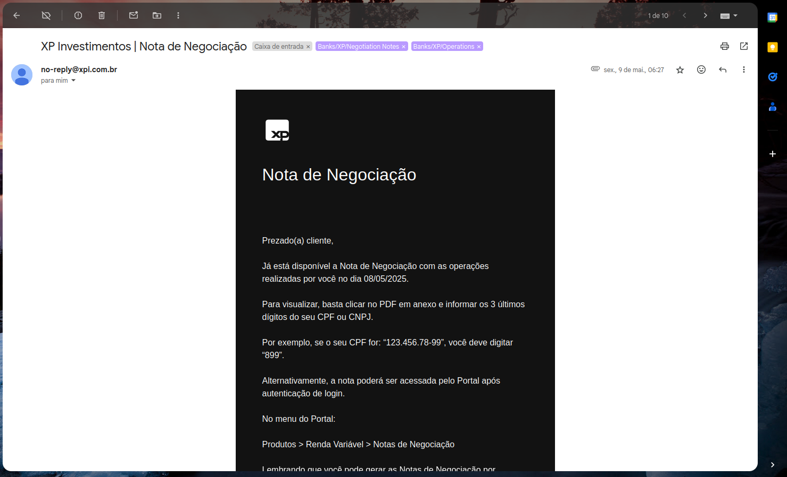
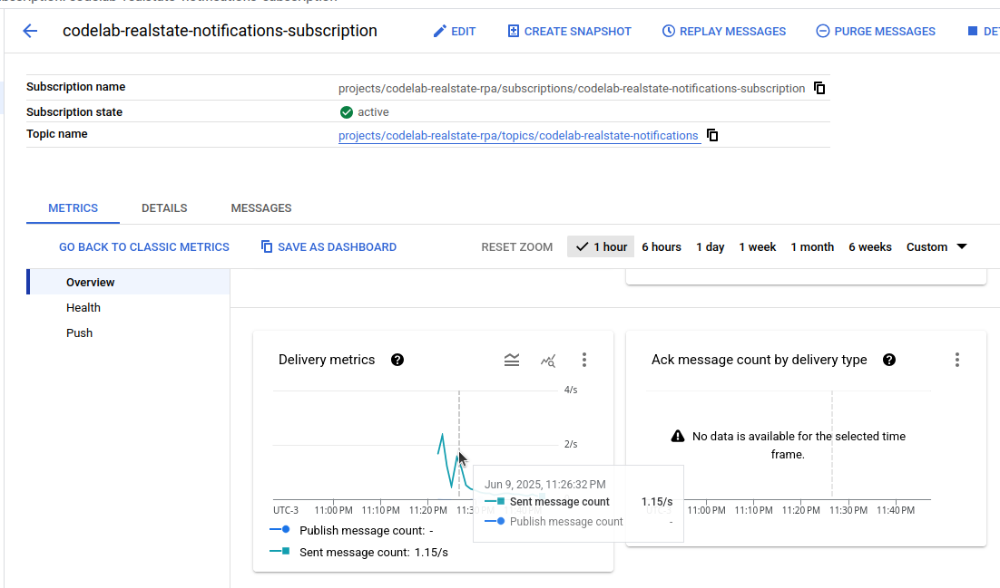
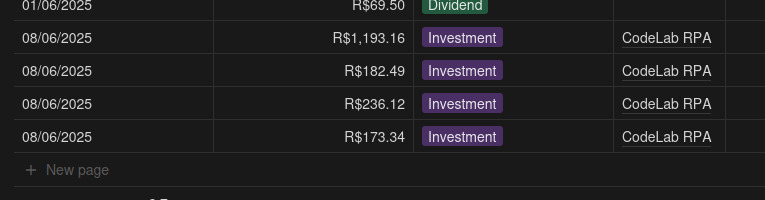
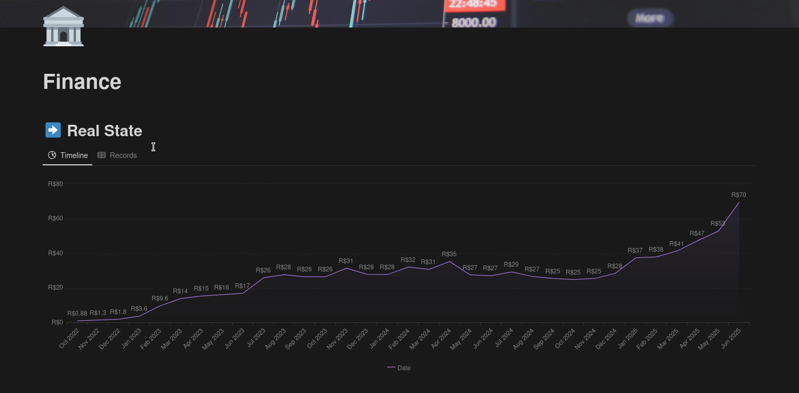

# Codelab Real State RPA

Este projeto automatiza o registro de investimentos em Fundos Imobiliários (FIIs) recebidos por e-mail da corretora XP Investimentos, integrando Gmail, Google Pub/Sub e Notion para atualizar automaticamente uma base de dados e gráficos no Notion.

---

## Visão Geral

Sempre que você investe em um FII, a XP envia um e-mail de confirmação (Notas de Negociação). Este sistema:

1. **Recebe o e-mail da XP** via integração com o Gmail.
2. **Dispara um webhook** usando o Google Pub/Sub.
3. **Processa o conteúdo do e-mail** para identificar o CPF e o valor do investimento.
4. **Registra a operação** em uma tabela de um banco de dados do Notion.
5. **Atualiza automaticamente gráficos** no Notion com base nos dados registrados.

---

## Fluxo da Automação

1. **Gmail Watch:**  
   O sistema utiliza a API do Gmail para monitorar a chegada de novos e-mails da XP.

2. **Google Pub/Sub:**  
   Quando um e-mail relevante chega, o Gmail envia uma notificação para um tópico Pub/Sub, que aciona o webhook do sistema.

3. **Processamento:**  
   A rota /webhook/gmail da api processa o e-mail, extrai o CPF e o valor do investimento.

4. **Notion:**  
   Os dados extraídos são salvos em uma tabela do Notion, que alimenta gráficos e dashboards automaticamente.

---

## Tecnologias Utilizadas

- **Node.js** (TypeScript)
- **Express** (API/servidor)
- **Google Gmail API** (monitoramento de e-mails)
- **Google Pub/Sub** (webhook e notificações)
- **Notion API** (registro e atualização de dados)
- **Zod** (validação de variáveis de ambiente)

---

## Como funciona

1. **Inicialização do servidor**

   - O servidor Express é iniciado.
   - O Pub/Sub é configurado automaticamente caso necessário para receber notificações do Gmail.
   - O sistema se inscreve para receber notificações de novos e-mails.

2. **Recebimento de e-mail**

   - Ao receber um e-mail da XP, o Gmail envia uma notificação para o Pub/Sub.
   - O webhook do sistema é chamado automaticamente.

3. **Processamento e registro**

   - O conteúdo do e-mail é analisado.
   - O valor do investimento é extraídos.
   - Os dados são salvos no banco de dados do Notion.

---

## Prints do Processo

### 1. E-mail recebido da XP



### 2. Notificação Pub/Sub recebida



### 3. Registro no Notion



### 4. Gráfico atualizado no Notion



---

## Como rodar o projeto

1. **Configure as variáveis de ambiente** (veja `.env.example`).
2. **Instale as dependências:**

   ```sh
   npm install
   ```

3. **Inicie o servidor:**

   ```sh
   npm start
   ```

4. **(Opcional) Desative notificações do Gmail:**

   ```sh
   npm run unsubscribe:gmail
   ```

**Observações**

- Certifique-se de ter as credenciais corretas do Google e Notion.
- O banco de dados do Notion deve estar [configurado para aceitar as atualizações](https://developers.notion.com/docs/working-with-databases).
- O sistema depende do correto funcionamento do [Pub/Sub](https://cloud.google.com/pubsub/docs/subscription-overview) e [permissões de API](https://developers.google.com/workspace/gmail/api/auth/scopes).
